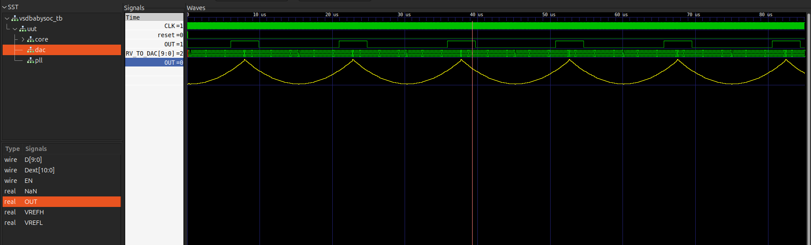

## Part 1: SoC (Theory)

### What is Soc?

A System on a Chip (SoC) is like a small computer made on a single chip. All the functions are combined into 1 single chip instead of multiple chips. This makes Soc more power and space efficient . SoC are present on smartphones, smartwatches etc.

#### Key Parts of an SoC:

1. **CPU** : The brain of the SoC. It does most of the processing and handles all the instructions given to it.

2. **Memory** : 
   
   - **RAM** for temporary storage of data before you shutdown the device.
   
   - **ROM** for the storage of data even after the device is shutdown.

3- **Graphics Processing Unit (GPU)** Handles the visual and graphics processing.

4- **I/O Ports** used to connect to external device like cameras, USB.

5- **Digital Signal Processor**: Processes audio and video signal.

6- **Power Management** Regulates power usage in the SoC improving its efficiency.

7- **Special Features** : Additional modules like the Wi-Fi, Bluetooth, GPS etc. 

#### Why SoCs Are Awesome

- **Space Saving**: Smaller devices.
- **Energy Efficient**: Lower power consumption.
- **High Performance**: Faster data processing.
- **Cost Effective**: Cheaper to manufacture.
- **Reliable**: Fewer failure points.

#### Where You’ll Find SoCs

- Smartphones, tablets, wearables, IoT devices, cars, TVs.

#### Some Popular SoCs

- Apple A-Series, Qualcomm Snapdragon, Samsung Exynos, NVIDIA Tegra.

#### Challenges with SoCs

- Complex design, heat issues, less flexibility.


## Part 2 -BabySoC Fundamentals & Functional Modelling

### Setup:

The directory should look like this:

```
VSDBabySoC/
├── src/
│   ├── include/
│   │   ├── sandpiper.vh
│   │   └── other header files...
│   ├── module/
│   │   ├── vsdbabysoc.v      # Top-level module integrating all components
│   │   ├── rvmyth.v          # RISC-V core module
│   │   ├── avsdpll.v         # PLL module
│   │   ├── avsddac.v         # DAC module
│   │   └── testbench.v       # Testbench for simulation
└── output/
└── compiled_tlv/         # Holds compiled intermediate files if needed
```

### Module Description:

1. **vsdbabysoc.v** : This is the top-level module that integrates the rvmyth, pll, and dac modules.

2. **rvmyth.v** : The rvmyth module is a simple RISC-V based processor. It outputs a 10-bit digital signal (OUT) to be converted by the DAC.

3. **avsdpll.v** : The pll module is a phase-locked loop that generates a stable clock (CLK) for the RISC-V core.

4. **avsddac.v** : The dac module converts the 10-bit digital signal from the rvmyth core to an analog output.

## Simulation Steps:

### Pre-synthesis simulation:

```shell
cd VSDBabySoC
make pre_synth_sim
```

This generates the **rvmyth.v** file from the **rvmyth.tlv** file and stores it in compiled_tlv folder.

Also the result of the simulation (i.e. `pre_synth_sim.vcd`) will be stored in the `output/pre_synth_sim` directory.

To see the output run :

```shell
gtkwave output/pre_synth_sim/pre_synth_sim.vcd
```



In this picture we can see the following signals:

- **CLK:** This is the `input CLK` signal of the core. This signal comes from the PLL, originally.
- **reset:** This is the `input reset` signal of the core. This signal comes from an external source, originally.
- **OUT:** This is the `output OUT` signal that comes from the DAC (due to simulation restrictions it behaves like a digital signal).
- **RV_TO_DAC[9:0]:** This is the 10-bit `output [9:0] OUT` port of the core. This port comes from the RVMYTH register #17.
- **OUT:** This is a `real` datatype wire which can simulate analog values. It is the `output wire real OUT` signal of the `DAC` module. This signal comes from the DAC.

### Post-synthesis simulation:

To synthesize the run the following :

```shell
make synth
```

This command `make synth` uses yosys to perform the sythesis. After this command a netlist is created stored in `output/synth/vsdbabysoc.synth.v` file.

#### Gate level Simulation

```shell
cd VSDBabySoC
make pre_synth_sim
```

The result of the simulation (i.e. `post_synth_sim.vcd`) will be stored in the `output/post_synth_sim` directory.

To see the output run :

```shell
gtkwave output/post_synth_sim/post_synth_sim.vcd
```

In this picture we can see the following signals:


- **\core.CLK:** This is the `input CLK` signal of the core. This signal comes from the PLL, originally.
- **reset:** This is the `input reset` signal of the core. This signal comes from an external source, originally.
- **OUT:** This is the `output OUT` signal that comes from the DAC (due to simulation restrictions it behaves like a digital signal).
- **\core.OUT[9:0]:** This is the 10-bit `output [9:0] OUT` port of the core. This port comes from the RVMYTH register #17.
- **OUT:** This is a `real` datatype wire which can simulate analog values. It is the `output wire real OUT` signal of the `DAC` module. This signal comes from the DAC.

## Yosys Final Report:

#### [Link to the Log File](../WEEK2/VSDBabySoC/output/synth)

```shell
=== vsdbabysoc ===

   Number of wires:               4737
   Number of wire bits:           6211
   Number of public wires:        4737
   Number of public wire bits:    6211
   Number of memories:               0
   Number of memory bits:            0
   Number of processes:              0
   Number of cells:               5913
     avsddac                         1
     avsdpll                         1
     sky130_fd_sc_hd__a2111oi_0      5
     sky130_fd_sc_hd__a211oi_1      10
     sky130_fd_sc_hd__a21boi_0       4
     sky130_fd_sc_hd__a21o_2         3
     sky130_fd_sc_hd__a21oi_1      686
     sky130_fd_sc_hd__a221oi_1     168
     sky130_fd_sc_hd__a22o_2         4
     sky130_fd_sc_hd__a22oi_1      137
     sky130_fd_sc_hd__a311oi_1       4
     sky130_fd_sc_hd__a31o_2         1
     sky130_fd_sc_hd__a31oi_1      315
     sky130_fd_sc_hd__a32oi_1        1
     sky130_fd_sc_hd__a41oi_1       17
     sky130_fd_sc_hd__and2_2        12
     sky130_fd_sc_hd__and3_2         1
     sky130_fd_sc_hd__clkinv_1     568
     sky130_fd_sc_hd__dfxtp_1     1144
     sky130_fd_sc_hd__lpflow_inputiso0p_1      1
     sky130_fd_sc_hd__mux2i_1       14
     sky130_fd_sc_hd__nand2_1      852
     sky130_fd_sc_hd__nand3_1      258
     sky130_fd_sc_hd__nand3b_1       1
     sky130_fd_sc_hd__nand4_1       53
     sky130_fd_sc_hd__nor2_1       428
     sky130_fd_sc_hd__nor3_1        42
     sky130_fd_sc_hd__nor4_1         3
     sky130_fd_sc_hd__o2111ai_1     24
     sky130_fd_sc_hd__o211ai_1      62
     sky130_fd_sc_hd__o21a_1        12
     sky130_fd_sc_hd__o21ai_0      856
     sky130_fd_sc_hd__o21bai_1      12
     sky130_fd_sc_hd__o221a_2        1
     sky130_fd_sc_hd__o221ai_1       3
     sky130_fd_sc_hd__o22a_2         1
     sky130_fd_sc_hd__o22ai_1      135
     sky130_fd_sc_hd__o311ai_0       3
     sky130_fd_sc_hd__o31a_2         1
     sky130_fd_sc_hd__o31ai_1        4
     sky130_fd_sc_hd__o32ai_1        1
     sky130_fd_sc_hd__o41ai_1        2
     sky130_fd_sc_hd__or2_2         12
     sky130_fd_sc_hd__xnor2_1       16
     sky130_fd_sc_hd__xor2_1        34
```
